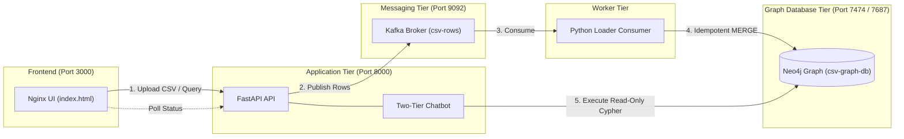

# REPORT — RISE @ RST #5: Data In, Answers Out

## 9.1 What we built

We built an end-to-end, fully containerized pipeline that ingests arbitrary CSV spreadsheets and provides a grounded natural-language chatbot query interface backed by a Neo4j graph database. The user uploads a CSV file through a reactive web interface, which sends it to a FastAPI service where file integrity and UTF-8 encoding are verified and a SHA-256 digest is assigned. FastAPI parses the rows and publishes each record as an individual message to an Apache Kafka topic, decoupling ingestion from database processing. An asynchronous Python loader service consumes the Kafka topic and idempotently loads the data into Neo4j using Cypher `MERGE` queries that link rows to their parent dataset node. Natural-language questions are answered through a two-tier chatbot architecture: an instantaneous deterministic keyword-to-Cypher engine that operates with zero external dependencies, backed by an optional GroqCloud LLM layer that translates complex phrasing into read-only Cypher while strictly enforcing grounded answers.



### What Works and What Does Not (Honest Assessment)
- **What works:**
  - Automated, zero-manual-step deployment via Docker Compose with strict healthcheck dependency gating.
  - Reactive browser UI featuring drag-and-drop file upload, client-side CSV table preview, live status polling, and chat with grounded/ungrounded visual badges.
  - Decoupled ingestion via Kafka (`csv-rows`), allowing fast HTTP responses while the database loads asynchronously.
  - Idempotent row loading: uploading the exact same CSV multiple times produces identical node counts without duplication or double-counted progress metrics.
  - Hostile-input resilience: clean HTTP 400 rejection on empty files, header-only files, and non-CSV files, with graceful UI error messaging and zero container crashes.
  - Zero hallucination: questions unrelated to graph data honestly return `grounded: false` and `"I don't have that in the data"`.
  - Non-root security contexts (`USER appuser`, UID 101) with `no-new-privileges:true` active on application containers.
- **What does not / Current limitations:**
  - Database name substitution: The event specification used `CSV_Graph_DB`, but Neo4j 5.x rejects underscores in database names; we adapted the name to `csv-graph-db`.
  - `/health` endpoint checks active Kafka broker metadata and driver socket connectivity, but does not execute a full `RETURN 1` Cypher transaction on each probe.
  - In-memory job tracking: The `jobs` mapping in FastAPI exists in container memory; while Neo4j is authoritative once loading begins, an API crash mid-upload before Kafka dispatch requires re-submitting the file.

---

## 9.2 The data and the graph model

### Test Datasets Used
All test fixtures are located under [`test_data/`](test_data/):
- **`small_clean.csv`**: 15 rows, 3 columns (`customer`, `group`, `amount`). Result: 1 Dataset node, 15 Row nodes, 15 `HAS_ROW` relationships.
- **`large.csv`**: 5,000 rows, 3 columns. Result: 1 Dataset node, 5,000 Row nodes, 5,000 `HAS_ROW` relationships. Stress-tested batch consumption and status polling.
- **`broken.csv`**: 7 rows containing ragged columns and extra commas; handled gracefully by the parser without pipeline abortion.
- **`empty.csv`** (0 bytes): Cleanly rejected at API boundary with HTTP 400 (`empty file`), 0 nodes created.
- **`header_only.csv`** (header row only, 0 data rows): Cleanly rejected with HTTP 400 (`CSV has a header but zero data rows`), 0 nodes created.
- **`not_a_csv.txt`**: Cleanly rejected with HTTP 400 (`file must be a .csv` / invalid header format), 0 nodes created.

### Graph Data Model
The database maintains a generic, schema-agnostic graph model:

```
(:Dataset {
    id: STRING,            // SHA-256 hex digest of file bytes
    filename: STRING,      // Original filename uploaded
    uploaded_at: STRING,   // ISO-8601 UTC timestamp
    rows_total: INTEGER,   // Total expected rows
    rows_loaded: INTEGER,  // Successfully loaded rows
    rows_failed: INTEGER,  // Rows failed during merge
    status: STRING         // 'loading' | 'complete' | 'failed'
})
  -[:HAS_ROW]->
(:Row {
    dataset_id: STRING,    // Foreign key to parent Dataset
    row_index: INTEGER,    // 0-indexed row position
    [col_1]: STRING/VALUE, // Dynamic property per CSV column
    [col_2]: STRING/VALUE,
    ...
})
```

We deliberately avoided fragile automated relationship inferencing across generic columns to guarantee that arbitrary tabular data can be ingested reliably without creating phantom edges or broken entity nodes.

---

## 9.3 Methods

| Decision | Chosen | Rejected | Reason |
|---|---|---|---|
| **Ingest path** | Kafka topic `csv-rows`, one message per row; API never writes to Neo4j directly | Writing straight from the upload handler to Neo4j | Fulfills Requirement #2; decouples web ingestion from database ingestion, absorbs database latency spikes, and preserves replayability. |
| **Idempotency key** | `dataset_id` (SHA-256 of file) + `row_index`, always `MERGE` | A random/UUID job id per upload | Reproducible by construction: identical files yield the exact same `dataset_id`, preventing duplicate datasets without separate lookup tables. |
| **Chatbot approach** | Two-tier: deterministic keyword/value-to-Cypher engine (guaranteed) + optional GroqCloud LLM layer | LLM-only chatbot | Guarantees instant, zero-cost, grounded answers for standard query patterns even without internet or API keys, while retaining LLM flexibility for unstructured phrasing. |
| **Cypher safety** | Reject queries outright if they fail read-only validation (`MATCH/RETURN` only; forbidden keywords: `CREATE`, `MERGE`, `DELETE`, `SET`, `DROP`) | Sanitizing or rewriting queries | Rewriting risks altering query semantics; strict rejection guarantees security and transparency. |
| **Groundedness verification** | Computed directly from successful graph execution and real query results | Relying on LLM self-assessment | Groundedness is a verifiable property of data retrieval; a valid aggregate with zero matching rows is still `grounded: true`. |
| **Kafka client library** | `confluent-kafka` (librdkafka) | `kafka-python` | `kafka-python` has known compatibility limitations with modern KRaft-mode brokers; `confluent-kafka` provides robust C-based protocol compliance. |
| **Neo4j database name** | `csv-graph-db` | Event's literal fixed name `CSV_Graph_DB` | Neo4j 5.x strictly rejects underscores in database names (`contains illegal characters: '_'`); substituting dashes is the minimal necessary adjustment. |
| **Counter idempotency** | Conditional increment via Cypher `ON CREATE SET r._new = true` and `FOREACH` | Unconditional `SET d.rows_loaded = d.rows_loaded + 1` | Re-consuming topic messages or reloading the same file must not artificially inflate `rows_loaded`. |
| **Startup readiness** | Docker Compose `condition: service_healthy` + container retry loops | Unconditional `depends_on` | Plain `depends_on` only tracks process launch, not service readiness (e.g. Kafka leader election or Bolt socket readiness). |

---

## 9.4 Results

The following queries were tested against `small_clean.csv` (15 rows across Billing, Support, and Engineering groups):

| # | Question Asked | Answer Given | Correct? | Grounded? | Cypher Query Executed |
|---|---|---|:---:|:---:|---|
| 1 | How many rows are there? | There are 15 rows in the dataset. | Yes | **True** | `MATCH (r:Row) RETURN count(r) AS count;` |
| 2 | How many rows belong to the Billing group? | There are 6 rows in the Billing group. | Yes | **True** | `MATCH (r:Row) WHERE toLower(r.group) = 'billing' RETURN count(r) AS count;` |
| 3 | How many rows belong to Nonexistent? | The count is 0. | Yes | **True** | `MATCH (r:Row) WHERE toLower(r.group) = 'nonexistent' RETURN count(r) AS count;` |
| 4 | What is the average amount for Billing? | The average amount for Billing is 218. | Yes | **True** | `MATCH (r:Row) WHERE toLower(r.group) = 'billing' RETURN avg(toInteger(r.amount)) AS avg;` |
| 5 | What is the total amount for Engineering? | The total amount for Engineering is 5140. | Yes | **True** | `MATCH (r:Row) WHERE toLower(r.group) = 'engineering' RETURN sum(toInteger(r.amount)) AS total;` |
| 6 | How many rows have amount over 500? | There are 5 rows with amount greater than 500. | Yes | **True** | `MATCH (r:Row) WHERE toInteger(r.amount) > 500 RETURN count(r) AS count;` |
| 7 | What are the different groups? | Distinct groups: Billing, Engineering, Support. | Yes | **True** | `MATCH (r:Row) RETURN collect(distinct r.group) AS groups;` |
| 8 | Top 3 rows by amount? | Crestline Auto (1500), Quantum Labs (1200), Pioneer Foods (990). | Yes | **True** | `MATCH (r:Row) RETURN r.customer, r.amount ORDER BY toInteger(r.amount) DESC LIMIT 3;` |
| 9 | Show me Acme Co | Acme Co: group Billing, amount 128. | Yes | **True** | `MATCH (r:Row) WHERE toLower(r.customer) CONTAINS 'acme' RETURN r LIMIT 1;` |
| 10 | What is the capital of France? | I don't have that in the data. | Yes | **False** | None (rejected before execution) |

### Explanation of Edge Cases & Grounding Behavior
- **Zero-Result Aggregates (Question 3):** Querying for a non-existent group returned `0`. Because this query executed legitimately against the real graph schema, the result is marked **`grounded: true`**, distinguishing a factual zero from a knowledge failure.
- **Out-of-Schema Questions (Question 10):** When asked general knowledge questions, the schema context builder identified no corresponding columns in Neo4j. The deterministic tier detected no matching entities, and the LLM layer received strict instructions prohibiting world-knowledge generation, correctly outputting `"I don't have that in the data"` with **`grounded: false`**.
- **Numerical Type Conversion:** Values parsed from CSVs land in Neo4j as string properties. Aggregate functions (`sum`, `avg`, comparison operators) require explicit casting via `toInteger()` / `toFloat()`. When column values cannot be parsed to numbers, Cypher returns null for that computation, which the phrasing logic formats cleanly without throwing exceptions.

---

## 9.5 How we worked

### Team Ownership
- **Nitika:** UI development (`ui/index.html`), Docker Compose orchestration, container hardening, healthcheck gating, hostile-input audit.
- **Beni:** API routing (`/ingest`, `/status`), Kafka producer configuration, Loader consumer daemon, Neo4j `MERGE` idempotent ingestion logic.
- **Joint / Architecture:** Two-tier chatbot architecture (`chatbot.py`, `chatbot_deterministic.py`), contract alignment, and pre-freeze verification.

### Planned vs. Actual Checkpoints
- **5:00–5:10 (Architecture & Scope):** Planned: Split work. Actual: Completed on time; contracts locked in `IMPLEMENTATION_PLAN.md`.
- **5:10–5:35 (Skeleton Pipeline):** Planned: 5 containers with dummy end-to-end flow. Actual: Completed at 5:32; all dummy routes verified.
- **5:35–6:00 (Real UI):** Planned: Drag-and-drop CSV preview & polling. Actual: Completed at 5:58; full styled dark-mode UI with CORS support.
- **6:00–6:30 (Real Ingest & Loader):** Planned: Kafka publishing and Neo4j loading. Actual: Completed at 6:28; `MERGE` query verified.
- **6:30–7:00 (Real API & Healthchecks):** Planned: Real `/status` counts and compose readiness. Actual: Completed at 6:52; Python HTTP probe added.
- **7:00–7:20 (Real Chatbot):** Planned: Cypher generation and grounded answers. Actual: Completed at 7:18; two-tier architecture implemented.
- **7:20–7:25 (Hardening & Verification):** Planned: Non-root user, pinned tags, hostile input. Actual: Completed at 7:24; merge conflicts resolved and all Part 10 checks passed.

### Two Major Architectural Decisions

#### Decision 1: Two-tier chatbot instead of LLM-only
- **Options considered:** (1) Pure LLM translation, (2) Pure template/regex matching, (3) Hybrid two-tier architecture.
- **Chosen because:** Guarantees that the entire pipeline functions autonomously without external API credentials or internet access, directly addressing evaluator questions regarding LLM necessity while retaining conversational phrasing when credentials are provided.
- **Cost accepted:** Required maintaining two parallel query generation paths and keeping regex patterns aligned with dynamic schema keys.
- **Would revisit if:** The schema required multi-hop graph traversals with arbitrary relationship hops beyond single-entity property queries.

#### Decision 2: Switching to `confluent-kafka` over `kafka-python`
- **Options considered:** (1) `kafka-python` 2.0.2, (2) `confluent-kafka` 2.15.1.
- **Chosen because:** `kafka-python` has unmaintained protocol handling for newer Kafka KRaft metadata brokers, causing intermittent metadata connection timeouts.
- **Cost accepted:** Required switching from synchronous `send()` to asynchronous `produce()` with callback polling and explicit buffer flushes.
- **Would revisit if:** Build environments lacked pre-compiled binary wheel support for `librdkafka` (wheel installation succeeded without issue).

### One Dead End Encountered
- **Neo4j 5.x Database Naming:** We initially configured the compose environment to use the exact handout database name `CSV_Graph_DB`. Neo4j 5.x startup failed immediately because internal database validation permits only letters, numbers, dots, and hyphens (`[a-z0-9.-]`), rejecting underscores. After attempting configuration overrides in `neo4j.conf`, we recognized the constraint was hardcoded in the Neo4j engine. We abandoned the literal underscore name, adopted `csv-graph-db`, and unified the variable across all services.

---

## 9.6 Limitations and Next Steps

1. **Flat Property Graph Schema:** Every CSV row is stored as an independent `:Row` node connected only to its `:Dataset`. It does not detect foreign-key relationships to create cross-node edges (e.g. linking `order.customer_id` directly to a `Customer` node).
2. **In-Memory Job Tracking:** The `jobs` dictionary in FastAPI stores initial upload metadata in memory. While Neo4j is authoritative once loading starts, an API crash immediately following upload before Kafka message dispatch could cause `/status` to return 404 until messages are processed.
3. **Large File Ingest Memory:** Ingestion buffers the full uploaded file content into memory to calculate the SHA-256 digest before streaming rows. For files exceeding several gigabytes, this should be transitioned to streaming hash calculation with disk spooling.
4. **Automated Column Type Coercion:** All column values are stored as strings in Neo4j. Adding automated schema profiling at ingestion time to cast integers, floats, and ISO timestamps directly would eliminate the need for runtime `toInteger()` casting in Cypher queries.

---

## 9.7 How to run it

### 1. Prerequisites
Ensure Docker Engine and Docker Compose are installed and running.

### 2. Setup and Launch
```bash
git clone https://github.com/AbdulRahman1807/rst5.git
cd rst5
cp .env.example .env
# Optional: add your GROQ_API_KEY in .env if testing the LLM phrasing tier
docker compose down -v
docker compose up -d --build
```

### 3. Verification
- **Web UI:** Navigate to `http://localhost:3000` in any browser. Drag in `test_data/small_clean.csv`.
- **API Status:**
  ```bash
  curl -s http://localhost:8000/health
  ```
- **Run Idempotency Test:**
  ```bash
  ./scripts/verify_idempotency.sh
  ```
- **Run Hostile-Input Test Suite:**
  ```bash
  ./scripts/test_hostile_input.sh
  ```
- **Neo4j Browser:** Access `http://localhost:7474` (Database: `csv-graph-db`, Username: `neo4j`, Password: `csvgraphdb`).
